# Seminário de Orientação do Projeto Integrador
CURSO: TECNOLOGIA EM SISTEMAS PARA INTERNET

TEMA: SISTEMA DE GERENCIAMENTO PARA FRUTAS E VERDURAS

GRUPO: 
 FERNANDA BEATRIZ TAVARES GOMES

 POLIANA DE ARAUJO PEREIRA

 JONATHAN LEONCIO DE SOUZA LIRA
 
## Introdução

## Proposta do Projeto (Poliana)
### Justificativa 
Segundo a Empresa Brasileira de Pesquisa Agropecuária (Embrapa), o desperdício de alimentos no Brasil acontece em toda a cadeia de produção:

10% do que é colhido se perde ainda no campo 

50% é desperdiçado no manuseio e transporte

30% perdido na comercialização e abastecimento

10% é jogado fora nos supermercados, restaurantes e em nossas próprias casas

### Objetivos
USCANDO FORMAS DE REDUZIR O DESPERDÍCIO DESSES ALIMENTOS, ATRAVÉS DA IMPLEMENTAÇÃO DE UM APLICATIVO PARA O CONTROLE DAS FRUTAS E HORTALIÇAS
### Especificos:
CONHECIMENTO DAS DISCIPLINAS
PESQUISAS E DESENVOLVIMENTO

### Recursos Necessários:
PESQUISAS E TESTES
DESENVOLVIMENTO DE APLICATIVO
DISPOSITIVO DE GERENCIAMENTO:
SENSORES DE MONITORAMENTO (TEMPERATURA, UMIDADE)

## Diagrama de Gantt e Atividades (Fernanda)

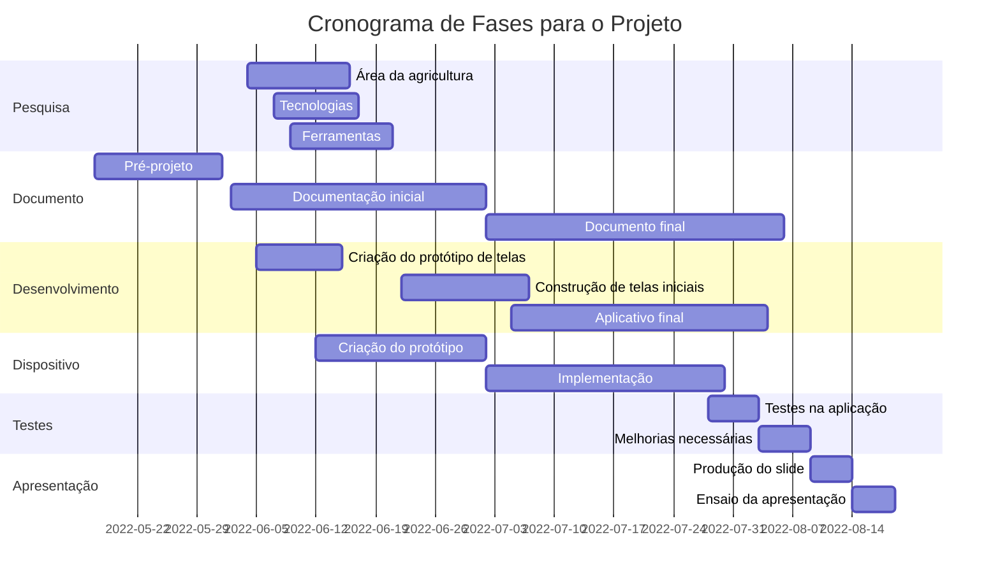
 
## Conhecimentos das disciplinas para o Desenvolvimento (Fernanda)
Nessa parte iremos falar sobre conhecimentos e ferramentas das disciplinas estudadas, para o desenvolvimento desse projeto.

### Desenvolvimento de Dispositivos Móveis
Consiste no desenvolvimento de um aplicativo (software) responsável por exibir informações ao usuário sobre o nível de maturidade de algumas frutas e hortaliças, através de dados coletados pelo dispositivo em Arduino, dados como temperatura, umidade com recomendação para melhor ambiente, temperatura e umidade adequadas, para a melhor conservação desses alimentos. Esse aplicativo será desenvolvido em Delphi, no ambiente de desenvolvimento Rad Studio, multiplataforma, podendo ser acessado em qualquer dispositivo, facilitando o acesso para os dispositivos móveis (Celulares, Tablets). Na disciplina estamos aprendendo sobre o desenvolvimento pelo Rad Studio, Delphi, funcionalidades, APIs, Design; e poderemos utilizar tudo isso para o projeto.
### Programação para Internet das Coisas
Será utlizada para o dispositivo em Arduino, conciliado com sensores de umidade e temperatura, para fazer a coleta de dados das frutas e hortaliças, gerenciando controle de amadurecimento e dias de duração, sugerindo melhorias relacionadas a ambiente, transporte, temperatura, umidade e outros fatores. Buscando atráves desse gerenciamento reduzir fatores de aprodrecimento e do desperdicio de frutas e verduras. Visando utilizar dos conhecimentos obtidos na disciplina, tais como utilização de Arduino, Sensores, atuadores, conexões, programação, utiliando plataforma como: Tinkercad para simulação, Node Red, Programa do Arduino e outros fatores e funcionalidades.
### Teste de Software 
Em todo projeto ou software é necessário a fase de testes, para o melhor desenvolvimento, buscando falhas, propondo melhorias e a melhor utilização dos usuários. Visto isso, e a forma de desenvolvimento do software, optamos por utilizar O Delphi, no Rad Studio também, que é um ambiente que permite encontrar soluções para a proposta de projeto, como também formas integradas de testes nesse aplicativo. 

Também será utilizado a fase de teste no dispositivo, visto que p setor de alimentos (frutas e hortaliças), desde o seu cultivo até à sua comercialização ao cliente, nesse percurso há uma série de processos pelo qual exige dados precisos em tempo real por meio de equipamentos de leitura de indicadores de condições climáticas, integrado à IoT. Dessa forma, disponibilizam por meio dos dados que se transformam em informações com mais exatidão na qualidade final desses produtos, evitando possíveis perdas e desperdícios comuns nesse setor de hortifruti. Nesse contexto, a linguagem Delphi é considerada mais apropriada por suportar testes em tempo real e possibilitar facilmente a correção de erros de programação em script de Banco de Dados, APIs, entre outros.

Conhecimentos esses obtidos na disciplina de Teste de Software, referente a ferramenta Rad Studio, como também melhores formas e funcionalidades na realização de testes no aplicativo e etc.

## Interfaces Gráficas para aplicativo (Jonathan)

#### Esse trabalho consiste em apresentar capturas do prototipo das interfaces gráficas e suas respectivas descrições para assim informar sobre as funcionalidades e fluxos para o aplicativo que será desenvolvido e utilizado durante o desenvolvimento do Projeto Integrador.

### Interface 1 : Tela Inicial 
#### A Interface Inicial do aplicativo, que será a primeira a ser exibida para os usuários, trazendo dados sobre o aplicativo e formas para se conectar e usar o aplicativo. Possui uma logomarca (à definir), uma pequena descrição para informar o objetivo do aplicativo ao usuário, um botão para realizar o cadastro dos usuários para poderem assim utilizar o software e um botão para realizar o login quando o usuário ja tiver um cadastro feito.

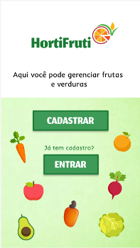

### Interface 2: Login e Cadastro 
#### As Próximas Interfaces são: Cadastro, em que os usuários poderão registrar seus dados, deixando-os armazenados para os próximos acessos os dados, que deverão ser preenchidos são Nome da Empresa ou nome do Responsável pela empresa, email para login e a senha de acesso do sistema, também possui a logomarca para identificação e o botão para confirmação do formulário. Já para a tela de realizar login, possui o preenchimento dos dados de email e senha, que haverá a verificação para o login, e o botão para avançar.
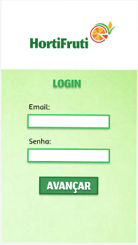 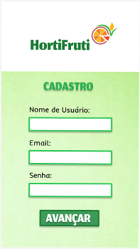

### Interface 3 : Menu das frutas/verduras
#### Para o usuário selecionar as opções das frutas disponíveis é clicar no botão da imagem da fruta necessária ou hortaliça. Caso não tenha o botão da fruta ou hortaliça no menu, será pesquisado atras do botão "outras opções" no espaço ou o usuário colocará digitado a fruta ou hortaliça e clica no botão da lupa de pesquisar. Após clicar em fruta disponível no menu ou escrever a opção vai ser enviada para outra tela com a dica da fruta ou hortaliça.
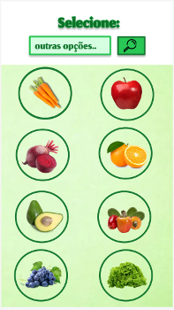

### Interface 4 : Menu de dados
#### Após escolher a fruta ou verdura que será analisada pelo dispositivo, o usuário será direcionado para a interface contendo um Menu com todos os dados e fluxos que poderão ser apresentados, no caso, botões com seus respectivos caminhos, para analise de dados da temperatura, umidade, ventilação e também fluxos para ambiente adequado, condições no transporte e dicas para melhor conservação desses alimentos.

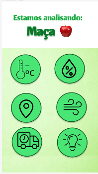

### Interface 5 : Temperatura
#### Logo após passar pela Tela do MENU de DADOS, e anteriormente escolhido o tipo de de fruta ou verdura para análise, e posteriormente definido a CATEGORIA DO INDICADOR DE MEDIDA DE CONDIÇÕES dos produtos, você chegará a esta tela acerca da TEMPERATURA, embora esteja explícito a informação dos dados exclusivamente da fruta MAÇÃ, você pode optar por escolher qualquer outro tipo de dado sobre uma outra fruta, ou hortaliça de seu interesse/necessidade.
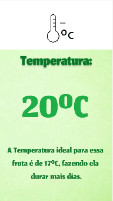

### Interface 6 : Umidade
#### Nesta tela destacar o informe do percentual adequado de Umidade para determinadas frutas e hortaliças em geral, pois boa parte precisam de uma umidade correspondente a umidade relativa ao seu ambiente natural, com 50 %, pois Umidade muito abaixo causa o ressecamento desses produtos e leva ao inevitável perda de nutrientes
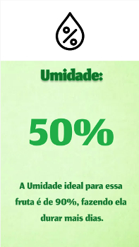

### Interface 7 : Ambiente
#### Após passar pela Interface correspondente ao MENU de DADOS, nesta tela de direcionamento referente ao AMBIENTE é importante que O bom uso do frio por meio de uma Cadeia de Refrigeração bem ativado & Organizada uma grande importância na manutenção da qualidade das frutas e /ou hortaliças. Ao respirar como quaisquer plantas das plantas as frutas/horizonte continuando e transpirando como vivo. Aqui o Usuário/cliente terá a oportunidade de conferir tipos de locais mais adequados para o controle total dos produtos de seu interesse
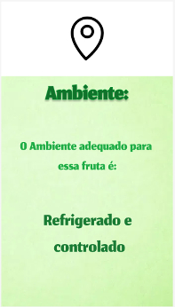

### Interface 8 : Transporte
#### Nesta interface a imagem do transporte é apenas ilustrativa não serve como botão. No eclipse com fundo verde que demonstrará através de uma nova temperatura é um botão que irá mostrar a página que medirá a temperatura máxima, média e outro eclipse com imagem de mapa é um botão que analisaremos se será necessário uma interface ou será um link para páginas.
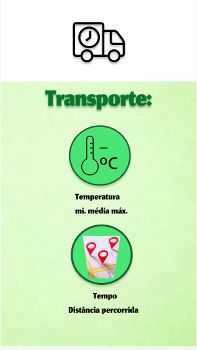

### Interface 9 : DicasAo clicar na fruta escolhida que está na interface de menu, o usuário vai abrir uma nova interface denominada como “dicas”,  de acordo com cada fruta ou hortaliça escolhida vai ser apresentado dicas sobre o produto. As dicas informam como manter o estado de conservação e como as frutas podem ser bem conservadas. Já nas hortaliças as dicas variam de acordo com a escolha da hortaliça. A temperatura e forma de limpeza são exemplos de dicas dessas interfaces, entre outras dica.

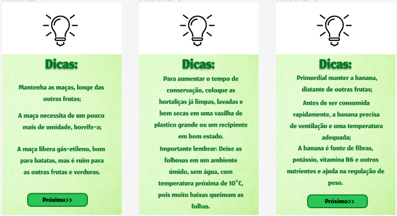

### Referências
#### Interfaces desenvolvidas no site Figma, acesso em: https://www.figma.com/file/8SHqs54sIrCo1XMQjrcTdA/Untitled?node-id=0%3A1
#### Visualização para Dispositivos móveis (celulares), mas também será responsivo para diversos dispositivos. Exemplo de visualização no dispositivo, acesso em: https://www.figma.com/proto/8SHqs54sIrCo1XMQjrcTdA/Untitled?node-id=2%3A2&scaling=contain&page-id=0%3A1
