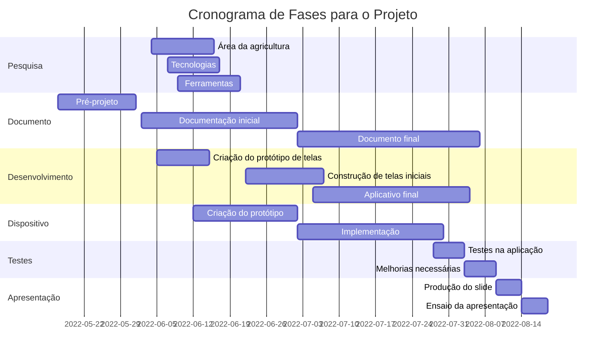

# Seminário de Orientação do Projeto Integrador
CURSO: TECNOLOGIA EM SISTEMAS PARA INTERNET

TEMA: SISTEMA DE GERENCIAMENTO PARA FRUTAS E VERDURAS

GRUPO: 
 FERNANDA BEATRIZ TAVARES GOMES

 POLIANA DE ARAUJO PEREIRA

 JONATHAN LEONCIO DE SOUZA LIRA
 
## Proposta do Projeto (Poliana)
// Topicos da primeira apresentação: Justificativa, objetivos, recursos necessários

## Diagrama de Gantt e Atividades (Fernanda)

## Conhecimento das disciplinas (Fernanda)
// topicos dos conhecimentos relacionados a IoT, Mobile e Teste
// exemplificar mais sobre os testes

## Interfaces Gráficas (Jonathan)
// apresentacao de todas as telas e explicações
